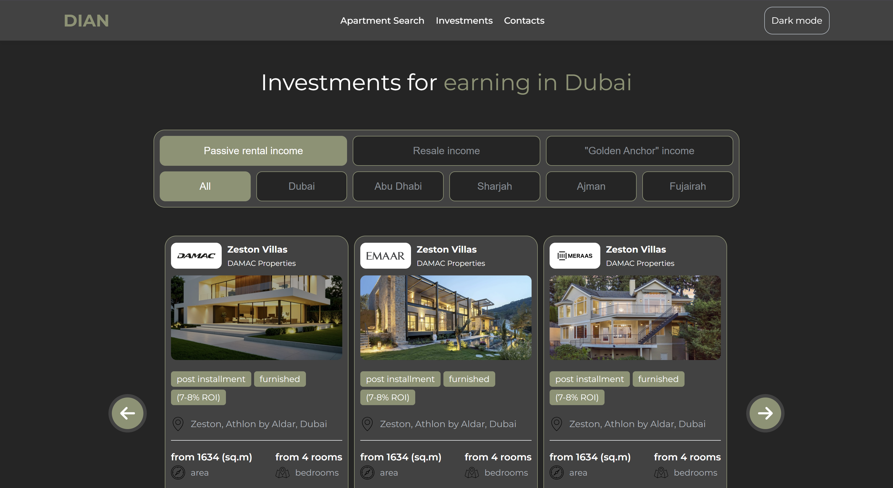

# 🏢 Dian Real Estate

Welcome to **Dian Real Estate** — a modern, interactive real estate platform where users can search, filter, and explore properties in Dubai. This project demonstrates responsive design, dynamic filtering, and interactive UI components like a burger menu and investment cards.

This project is live on [Netlify](https://your-live-link-here).

---

## 🔗 Demo

Check out the live project here: [Dian Real Estate on Netlify](https://dian-eng.netlify.app/)

---

## 📸 Screenshot

---

## 🚀 Features

- 🔍 **Search properties** by type, district, and price
- 🏠 **Filter options**: Apartments, Villas, Penthouses, Duplexes, Offices
- 🏙️ **District filter**: Quick selection of Dubai districts
- 💰 **Price filter**: Select property price ranges
- ❤️ **Favorites system**: Users can mark properties they like
- 📱 **Responsive design**: Works smoothly from mobile (320px) to desktop (1600px+)
- 🍔 **Responsive burger menu** for mobile devices

---

## 📦 File Structure

📂 css/ # Stylesheets
📂 img/ # Property images
📂 js/ # JavaScript logic
📂 sass/ # SASS files
│
├── 📁 abstracts/ # Variables, mixins, functions
├── 📁 base/ # Base styles (reset, typography)
├── 📁 cards/ # Card styles for properties
├── 📁 components/ # Reusable UI components
├── 📁 layout/ # Layout and grid styles
└── 📁 page/ # Page-specific styles

---

## 🧠 How It Works

1. Users can **search for a property** using the search form.
2. Apply **filters by type, district, or price**.
3. **Click the heart icon** to save favorite properties.
4. The app dynamically renders **property cards** with images, price, district, and type.
5. The layout is fully **responsive**, adapting to all screen sizes.
6. **Burger menu** appears on mobile devices for smooth navigation.

---

## ❗ Important

- This project helped me **practice responsive design, DOM manipulation, and interactive UI components**.
- Users can explore Dubai real estate, filter properties, and save favorites.

---

## 📄 License

This project is free for educational use.
